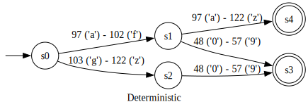

# Regular expression engine

This project is my own re-implementation of a regular expression engine.
It's built from scratch, using only [theory as reference](#references).

## Goals

The following are the things I want to learn from doing this project:

- [x] How regular expressions are converted to state machines
- [x] How to convert non-deterministic state machines into deterministic ones
- [x] Figure out how to adapt the ASCII-only ideas in the textbook I read to
      work with the full Unicode range[^unicode]

And the following are goals I have for my implementation:

- [x] Write everything by hand and from scratch
- [x] Handle Unicode, not just ASCII[^unicode]
- [ ] Handle the following regex operators:
    - [x] `()` - grouping
    - [ ] `[]` - character sets
    - [x] `|` - alternation
    - [x] `?` - zero or one
    - [x] `*` - zero or more
    - [x] `+` - one or more
    - [ ] `^` - start of string
    - [ ] `$` - end of string
- [x] Output the finite state machines in [GraphViz DOT format][gvdot] for
      visualization (see [Screenshots](#screenshots))

[gvdot]: https://graphviz.org/doc/info/lang.html

[^unicode]: Many textbooks and learning resources for regular expressions and
state machines assume that the input is ASCII. This greatly simplifies some of
the logic, as you can create edges/transitions in the state machines for each
individual character since there are only 127 possibilities. Modern software
uses Unicode, not just ASCII, so I wanted to figure out on my own how I could
make a state machine work with Unicode. Instead of creating an edge/transition
for each individual character (since there are up to 1,111,998 possibilities), I
created transitions for ranges, and broke these ranges into several disjoint
ranges as part of the NFA-to-DFA conversion.

## Screenshots

Deterministic finite state machine (DFA) generated for the regular expression pattern `a(x|y)*c`:
*c.svg)

Conversion of a non-deterministic finite state machine (NFA) to a deterministic
one (DFA):

## References

These are the resources I used to learn about regular expression matching and
finite state machines.

- [Compilers: Principles, Practice, and Tools][compilers-ptt]
    - Sections 3.6 and 3.7
- [Regular Expression Matching Can Be Simple And Fast][regex1]

[compilers-ptt]: https://en.wikipedia.org/wiki/Compilers:_Principles,_Techniques,_and_Tools
[regex1]: https://swtch.com/~rsc/regexp/regexp1.html
